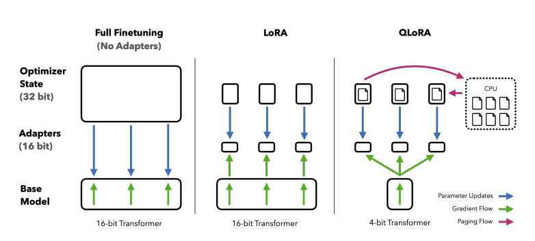

# Структурирование атрибутивной информации о большом наборе сложных объектов с помощью LLM

## Введение

Large Models (LMs) в последнее время привлекают значительный интерес общественности. Их способность понимать контекст и нюансы позволяет им умело справляться с разнообразными задачами в нескольких областях, включая обработку естественного языка (NLP), компьютерное зрение (CV) и и т.д. В области NLP Большие языковые модели (LLM) достигли значительного прогресса в различных задачах, включая генерацию текста [1], [2], перевод [3], [4], персонализированные чат-боты [5], [6], [7] и реферирование [8], показывая State-of-the-Art результаты.

Исследования [1] показали, что LLM демонстрируют высокий уровень обобщения, что позволяет им применять полученные знания для решения новых задач, не включенных в их первоначальное обучение. Эта способность обычно называется обучением с нуля (zero-shot learning). Тем не менее, finu-tuning остается ключевым методом для усовершенствования LLM для оптимальной работы на новых пользовательских наборах данных и задачах.

В рамках работы планируется применить большие языковые модели (LLM) для извлечения и структурирования ключевой атрибутивной информации из чековых данных покупок. Данные чеков содержат детальную информацию о тратах клиентов. Они помогают улучшать качество моделей кредитного скоринга и склонности к банковским продуктам, а также улучшать пользовательский опыт за счет структуризации трат клиентов в мобильном приложении. Однако работа с этим источником затрудняется его неструктурированностью: вся информация о купленном товаре лежит в одной строке произвольного формата.

В предположении что каждая чековая позиция описывает какой-либо товар, наименование этого товара, а также его бренд, являются главной информацией, которую можно извлечь из чека. По итогу задача структуризации этих данных ограничивается выделением и нормализацией брендов и товаров.

Цель работы - создать инструмент для анализа текстовых данные чеков, распознания и выделения упомянутых атрибутов. Это позволит переход от неструктурированных записей к формату, который способствует более глубокому анализу потребительского поведения и моделей покупок, открывая перед бизнесом новые возможности для принятия обоснованных решений.

## Данные

В рамках проекта стоит перед нами задача обработки огромного количества неразмеченных чековых данных, которые представляют собой серьезный вызов из-за их разнообразия и низкого качества. Эти данные часто содержат сокращения, ошибки, специфические символы, транслиты и другие неоднозначности, которые усложняют извлечение полезной информации. Примеры:

    СОК СОЧН ДОЛ ПЕРСИК ЯБЛ 1,93Л

    Колготки жен. 'INNAMORE' SUP SLIM 40 den (тон Nero) р-р 3

    36572156371 вино бон вояж совиньон бл 1.000 x 469.90

    Вода мин. 0,55л Сердце Контине

Обработка и структурирование таких данных требуют от LLM способности распознавать и интерпретировать сложные и неоднозначные паттерны текста.

## Background

Запущенная Meta в феврале 2023 года, серия LLaMA [9] представляет собой прорыв в области авторегрессивных больших языковых моделей (LLMs), использующих архитектуру Transformer [10]. Со своей первой версии (13 миллиардов параметров) она успела превзойти намного большую замкнутую модель GPT-3, которая имеет 175 миллиардов параметров. 18 апреля 2024 года Meta представила модель LLAMA3, предлагающую конфигурации на 8 миллиардов и 70 миллиардов параметров. Благодаря обширному предварительному обучению на более чем 15 триллионах data tokens, модели LLAMA3 достигли передовых результатов (SOTA) в широком спектре задач, утвердив семейство LLaMA в числе лучших открытых языковых моделей большого размера, доступных для разнообразных приложений и сценариев развертывания.

Несмотря на впечатляющие результаты, развертывание моделей LLAMA3 все еще представляет значительные трудности из-за ограничений ресурсов во многих сценариях. К счастью, low-bit квантование выделилось как одна из самых популярных техник для сжатия LLM. Этот метод сокращает требования к памяти и вычислительной мощности LLM на этапе инференса, позволяя им работать на устройствах с ограниченными ресурсами.


## Zero-shot learning and Few-shot learning

Спрос на модели глубокого обучения, способные хорошо обобщать и достигать высокой производительности при ограниченном количестве данных, постоянно растет.
постоянно растет. C выходом в 2020 году GPT-3[11] Few-Shot Learning (FSL) начал играть решающую роль в решении этой проблемы, позволяя моделям
обучаться всего на нескольких примерах, имитируя естественный способ обучения человека. В отличие от типичной практики в
DL, которая предполагает предварительное обучение моделей на больших наборах данных и их тонкую настройку на конкретных задачах, FSL позволяет моделям
эффективно обучаться на минимальном количестве помеченных примеров.

Однако обработка чековых данных является непростой задачей даже для современных языковых моделей. Из-за того что LLAMA3 подвергалась ограниченному обучению на русскоязычном материале, использование модели в режимах zero-shot и few-shot не даёт удовлетворительных результатов. На практике это означает, что модели сложно распознать и правильно интерпретировать сокращения и специфичные обозначения товаров, присущие чекам.

### Пример использования модели в Few-shot режиме:

Промпт:
```
Imagine that you are a professional receipt data analyst, normalizing raw texts, revealing abbreviations, highlighting the product, brand and product category on the receipt. Provide resoning for each step.

[Examples]
Expand abbreviations for products (receipt items), additionally highlight the product, brand and category: НЕК ЛЮБ ТОМАТ 0,95Л
Normalized product: Нектар Любимый Томат 0.95 литра##Нектар##Любимый

Expand abbreviations for products (receipt items), additionally highlight the product, brand and category: ВОДА ПИТЬЕВАЯ НЕГАЗ. \"ВОЛЖСКИЕ ДАЛИ\" 0,5Л ПЭТ
Normalized product: Вода питьевая негазированная \"Волжские Дали\" 0,5л в ПЭТ-бутылке##Вода питьевая##Волжские Дали
[End of examples]

Expand abbreviations for products (receipt items), additionally highlight the product, brand and category: СОК СОЧН ДОЛ ПЕРСИК ЯБЛ 1,93Л
Normalized product:
```
Результат:
```
Сок Сочи Дол Персик Яблоко 1,93 литра##Сок##Сочи Дол##Фруктовый сок

Here's what I did:

Expanded the abbreviation "СОК" to "Сок" (Juice)
Expanded the abbreviation "СОЧН" to "Сочи Дол" (Sochi Dol, a brand)
Identified the product category as "Фруктовый сок" (Fruit juice)
```

## Finetuning with QLoRA

Fine-tuning больших языковых моделей (LLMs) является чрезвычайно эффективным способом улучшения их производительности [12], [13], [14]. Однако fine-tuning очень больших моделей обходится запредельно дорого; обычный 16-битный tuning модели LLaMA с 65 миллиардами параметров требует более 780 ГБ памяти GPU. Несмотря на то что современные методы квантования могут уменьшить объем занимаемой памяти LLM [15], [16], [17], такие техники работают только для инференса и не выдерживают нагрузку во время обучения.

Для этого был разработан метод QLoRA [18], который позволяет обучать LLM с помощью меньшего количества параметров, сохраняя при этом высокую производительность. QLoRA сокращает средние требования к памяти для finetuning модели с 65 параметрами с >780 ГБ памяти GPU до <48 ГБ без ухудшения времени выполнения или качества по сравнению с 16-битной finetuned модели. Данный метод осуществляет существенный сдвиг в доступности fine-tuning LLM: теперь
крупнейшие на сегодняшний день публично доступные модели можно дообучать на 1-2 GPU.

Метод берет за основу Low-rank Adapters (LoRA) - подход, который позволяет снизить требования к памяти за счет использования небольшого набора обучаемых параметров, часто называемых адаптерами. Адаптеры представляют собой маленькие подмодели, которые добавляются к базовой модели и обучаются на новых данных. Вместо того чтобы обучать все параметры модели, адаптеры позволяют модели быстро адаптироваться к новым задачам, сохраняя при этом большую часть знаний, полученных во время предварительного обучения. Градиенты во время стохастического градиентного спуска передаются через фиксированные веса предварительно обученной модели адаптеру, который обновляется для оптимизации
функцию потерь. LoRA дополняет линейную проекцию дополнительной факторизованной проекцией. Если дана проекция $X W = Y$ с $X \in \mathbb{R}^{b \times h}, W \in \mathbb{R}^{b \times o}$, то LoRA представляет собой проекцию $$Y = X W + s X L_1 L_2,$$ где $L_1 \in \mathbb{R}^{h \times r}$ и $L_2 \in \mathbb{R}^{r \times o}$, и s - это скаляр.

QLoRA применяет низкоранговое приближение для модификации весов в матрице трансформера, позволяя существенно сократить количество параметров требуемых для тонкой настройки, в то же время квантование уменьшает размер этих параметров. Такой подход открывает новые перспективы для разработчиков моделей, склоняя баланс в сторону большей эффективности без потери качества работы модели.


*Рис 1. Различные методы finetuning и их требования к памяти. QLoRA превосходит LoRA за счет квантования модели-трансформера до 4-битного формата и использования paged оптимизаторов для обработки скачков востребования памяти.*

Можно сказать, что QLoRA использует один тип хранимых данных (обычно 4-битный NormalFloat) и тип данных для вычислений (16-битный BrainFloat). Мы деквантуем данные, хранящиеся в 4-битном формате, в формат для вычислений 16-битный BrainFloat, чтобы выполнить прямой и обратный проход, но мы вычисляем градиенты весов только для параметров LoRA, которые используют 16-битный BrainFloat.

Сравнивая QLoRA с традиционным полным finetuning, исследования показали, что средняя точность тестирования моделей LLaMA с 7 до 65 миллиардами параметров на задачах MMLU в режиме "5-shot learning", где использовались адаптеры на данных Alpaca и FLAN v2, не отличается для различных типов данных. В целом, NF4 с двойной квантизацией (DQ) показывает результаты, сопоставимые с производительностью BFloat16, в то время как FP4 стабильно отстает на один процентный пункт от обоих.

## Список литературы
1. T. Brown, B. Mann, N. Ryder, M. Subbiah, J. D. Kaplan, P. Dhariwal, A. Neelakantan, P. Shyam, G. Sastry, A. Askell et al., “Language mod- els are few-shot learners,” Advances in neural information processing systems, vol. 33, pp. 1877–1901, 2020.
2. Y. Zhuang, Y. Yu, K. Wang, H. Sun, and C. Zhang, “Toolqa: A dataset for llm question answering with external tools,” arXiv preprint arXiv:2306.13304, 2023.
3. W.Zhu,H.Liu,Q.Dong,J.Xu,L.Kong,J.Chen,L.Li,andS.Huang, “Multilingual machine translation with large language models: Empir- ical results and analysis,” arXiv preprint arXiv:2304.04675, 2023.
4. M. U. Hadi, R. Qureshi, A. Shah, M. Irfan, A. Zafar, M. Shaikh, N. Akhtar, J. Wu, and S. Mirjalili, “A survey on large language models: Applications, challenges, limitations, and practical usage,” TechRxiv, 2023.
5. B. Xu, X. Liu, H. Shen, Z. Han, Y. Li, M. Yue, Z. Peng, Y. Liu, Z. Yao, and D. Xu, “Gentopia: A collaborative platform for tool-augmented llms,” arXiv preprint arXiv:2308.04030, 2023.
6. G. Li, H. A. A. K. Hammoud, H. Itani, D. Khizbullin, and B. Ghanem, “Camel: Communicative agents for ”mind” exploration of large lan- guage model society,” in Thirty-seventh Conference on Neural Infor- mation Processing Systems, 2023.
7. Q. Wu, G. Bansal, J. Zhang, Y. Wu, S. Zhang, E. Zhu, B. Li, L. Jiang, X. Zhang, and C. Wang, “Autogen: Enabling next-gen llm applications via multi-agent conversation framework,” arXiv preprint arXiv:2308.08155, 2023.
8. H.Zhang,X.Liu,andJ.Zhang,“Summit:Iterativetextsummarization via chatgpt,” arXiv preprint arXiv:2305.14835, 2023.
9. Hugo Touvron, Thibaut Lavril, Gautier Izacard, Xavier Martinet, Marie-Anne Lachaux, Timothée Lacroix, Baptiste Rozière, Naman Goyal, Eric Hambro, Faisal Azhar, et al. Llama: Open and efficient foundation language models. arXiv preprint arXiv:2302.13971, 2023.
10. Ashish Vaswani, Noam Shazeer, Niki Parmar, Jakob Uszkoreit, Llion Jones, Aidan N Gomez, Łukasz Kaiser, and Illia Polosukhin. Attention is all you need. Advances in neural information processing systems, 30, 2017.
11. Tom Brown, Benjamin Mann, Nick Ryder, Melanie Subbiah, Jared D Kaplan, Prafulla Dhariwal, Arvind Neelakantan, Pranav Shyam, Girish Sastry, Amanda Askell, Sandhini Agarwal, Ariel HerbertVoss, Gretchen Krueger, Tom Henighan, Rewon Child, Aditya Ramesh, Daniel Ziegler, Jeffrey Wu, Clemens Winter, Chris Hesse, Mark Chen, Eric Sigler, Mateusz Litwin, Scott Gray, Benjamin Chess, Jack Clark, Christopher Berner, Sam McCandlish, Alec Radford, Ilya Sutskever, and Dario Amodei. Language models are few-shot learners. In Advances in Neural Information Processing Systems, volume 33, pages 1877–1901. Curran Associates, Inc. 2020.
12. J. Wei, M. Bosma, V. Y. Zhao, K. Guu, A. W. Yu, B. Lester, N. Du, A. M. Dai, and Q. V. Le. Finetuned language models are zero-shot learners. arXiv preprint arXiv:2109.01652, 2021.
13. L. Ouyang, J. Wu, X. Jiang, D. Almeida, C. Wainwright, P. Mishkin, C. Zhang, S. Agarwal, K. Slama, A. Ray, et al. Training language models to follow instructions with human feedback. Advances in Neural Information Processing Systems, 35:27730–27744, 2022.
14. Y. Wang, Y. Kordi, S. Mishra, A. Liu, N. A. Smith, D. Khashabi, and H. Hajishirzi. Self-instruct: Aligning language model with self generated instructions. arXiv preprint arXiv:2212.10560, 2022.
15. T. Dettmers, M. Lewis, Y. Belkada, and L. Zettlemoyer. LLM.int8(): 8-bit matrix multiplication
for transformers at scale. Advances in Neural Information Processing Systems 35: Annual Conference on Neural Information Processing Systems 2022, NeurIPS 2022, 2022.
16. T. Dettmers and L. Zettlemoyer. The case for 4-bit precision: k-bit inference scaling laws. arXiv preprint arXiv:2212.09720, 2022.
17. E. Frantar, S. Ashkboos, T. Hoefler, and D. Alistarh. Gptq: Accurate post-training quantization for generative pre-trained transformers. arXiv preprint arXiv:2210.17323, 2022.
18. T. Dettmers, A. Pagnoni, A. Holtzman, L. Zettlemoyer. QLoRA: Efficient Finetuning of Quantized LLMs. arXiv preprint arXiv:2305.14314, 2023.